FraudDetection
===
#### Автор:  Кондаков Никита

### Установка

#### Требования:
- Python
- Jupyter Notebook

### Датасет:
| Датасет | Скачать |
| ---     | ---   |
| FraudDetection | [Скачать](https://www.kaggle.com/datasets/kartik2112/fraud-detection) |

### Чтобы установить:
1. Скачайте файл или сделайте git-клонирование
2. Откройте Jupyter Notebook
3.	Выберите файл и запустите каждую ячейку

## Описание проекта
Тема: Обнаружение мошенничества с кредитными картами.

Цель: Разработать модель машинного обучения для выявления мошенничества с кредитными картами.

Мошенничество с кредитными картами представляет собой серьезную проблему для банков и других финансовых организаций. Мошенники могут использовать украденные карты для совершения покупок или снятия наличных. Это приводит к финансовым потерям для банков и неудобствам для клиентов.

Модель машинного обучения может быть использована для выявления мошеннических транзакций. Модель будет обучаться на наборе данных, содержащем информацию о транзакциях, как мошеннических, так и нормальных. После обучения модель сможет автоматически определять, является ли транзакция мошеннической.

## Разведочный анализ
Чтобы оценить различные методы машинного обучения для обнаружения мошенничества, я буду использовать набор данных, который общедоступен на Kaggle. Это набор данных смоделированных транзакций по кредитным картам, содержащий законные и мошеннические транзакции за период с 1 января 2019 года по 31 декабря 2020 года. Он охватывает кредитные карты 1000 клиентов, совершающих транзакции с пулом из 800 продавцов.

В датасете содержится 23 столбца:
-	index — уникальный идентификатор для каждой строки.
-	trans_date_trans_time — дата и время транзакции
-	cc_num — номер кредитной карты клиента
-	merchant - имя продавца
-	category - категория продавца
-	amt - сумма транзакции
-	first - имя держателя кредитной карты
-	last – фамилия владельца кредитной карты.
-	gender – пол владельца кредитной карты.
-	street – адрес владельца кредитной карты.
-	city - город держателя кредитной карты
-	state - штат держателя кредитной карты
-	zip — застежка-молния на держателе кредитной карты
-	lat - широта местоположения держателя кредитной карты
-	long — долгота местоположения держателя кредитной карты.
-	city_pop — население города владельца кредитной карты
-	job - вакансия держателя кредитной карты
-	dob — дата рождения владельца кредитной карты
-	trans_num - номер транзакции
-	unix_time - UNIX-время транзакции
-	merch_lat — широта местоположения продавца
-	merch_long — долгота местоположения торговца
-	is_fraud — флаг мошенничества (Целевой класс)

Проверим на пропущенные значения:

 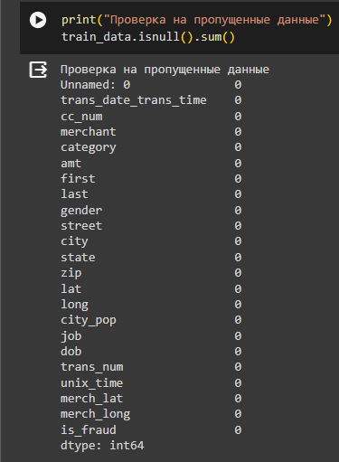

В датасете нет пропущенных значений.

Для дальнейшего анализа, я определил целевую переменную – **is_fraud**

Посмотрим, как она распределяется на нормальные и мошеннические транзакции:
  
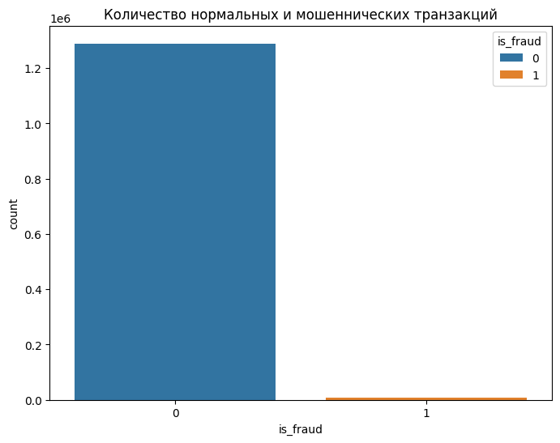

По диаграмме видно насколько несбалансированный исходный набор данных. Большинство транзакций не мошеннические. Если использовать этот датасет в качестве основы для прогнозных моделей и анализа, может получиться много ошибок, и алгоритмы, вероятно, будут переобучены, поскольку они будут «предполагать», что большинство транзакций не являются мошенничеством.

Сейчас существуют различные подходы к решению этой проблемы, один из них – это масштабирование данных, его я и буду использовать.

Посмотрим на признак category:

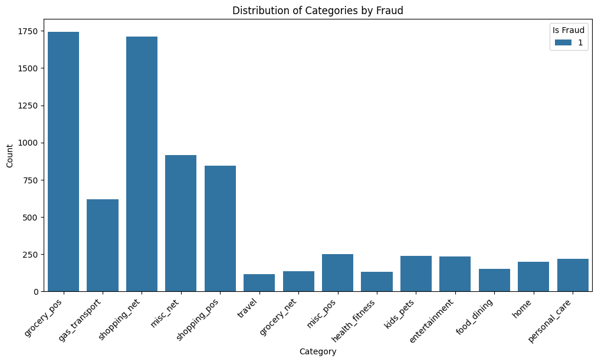

Как видно, больше всего мошеннических транзакций было в категориях: grocery_pos и shopping_net.

Теперь посмотрим на анализ времени:
 
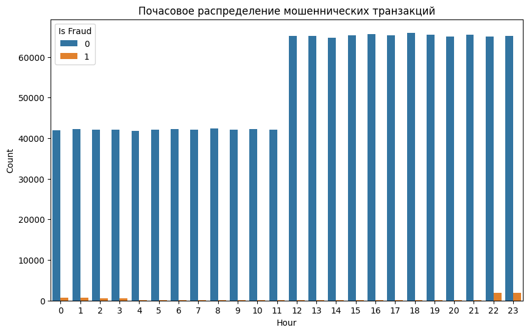

По диаграмме видно, что в основном мошеннические транзакции проводились ночью, начиная примерно с 22:00 вечера до 3:00 ночи. 


## Подготовка данных
Для дальнейшей работы и моделирование моделей, сначала нужно поработать с данными.

Первое, что я сделал это закодировал категориальные признаки(gender, category, state).

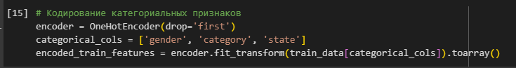
 
Второе, что я сделал это стандартизация признаков, чтобы убрать шум и выбросы в датасете, для повышения эффективности моделей.

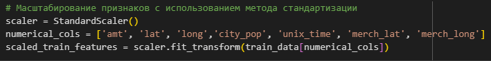
 
Потом я объединил эти признаки.

Результат:

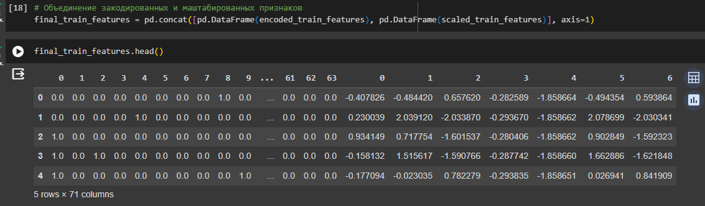
 
Следующий шаг, я сгенерировал данные для баланса. Потому что, мошеннических транзакций было намного меньше – это бы повлияло на точность моделей. 

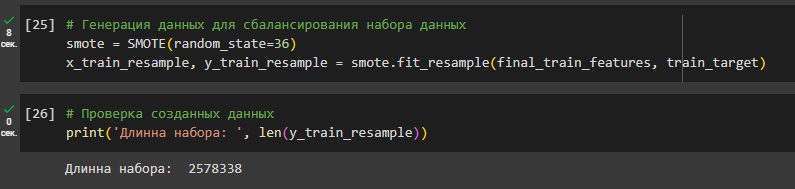
 
В результате получился сбалансированный датасет:

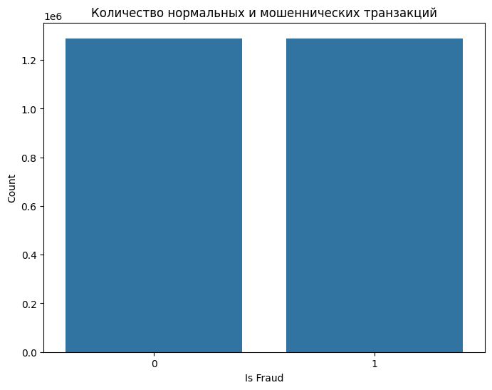

## Моделирование
Для моделирования, я брал разные модели, такие как Logistic Regression, SVM, KNN, RandonForest.

> 1.	Модель Logistic Regression.

` Точность у модели получилась: 81.299 % `

Посмотрим на ROC-диаграмму:
 
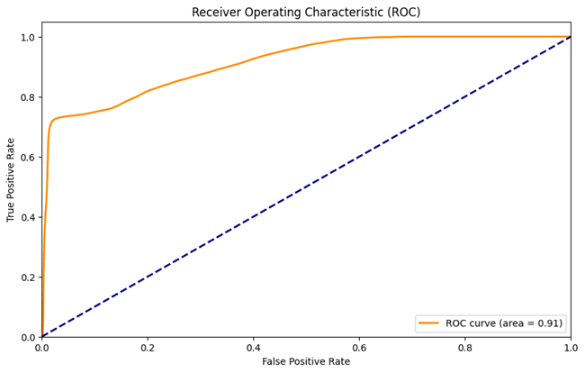

-	AUC-ROC составляет 0,91, что говорит о высокой прогностической способности модели.
-	Кривая ROC резко поднимается вверх от левого нижнего угла, что говорит о том, что модель хорошо различает положительные и отрицательные примеры.
-	Кривая ROC находится далеко от диагонали, что говорит о том, что модель значительно лучше, чем случайный классификатор.

Также посмотрим на матрицу ошибок:
 
 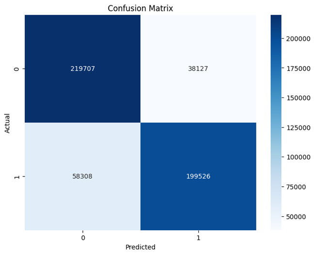

-	Модель правильно классифицировала 219 707 случаев как 0 и 199 526 случаев как 1.
-	Модель неправильно классифицировала 38 127 случаев как 0 и 58 308 случаев как 1.

> 2.	Модель SVM.

` Точность у модели получилась: 85.875% `

Посмотрим на ROC диаграмму:

 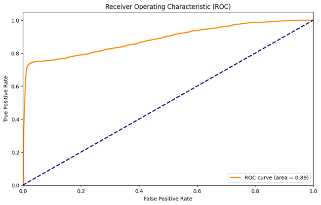

-	AUC-ROC составляет 0,89, что говорит о высокой прогностической способности модели, но меньше чем у логистической регрессии.
-	Кривая ROC резко поднимается вверх от левого нижнего угла, что говорит о том, что модель хорошо различает положительные и отрицательные примеры.
-	Кривая ROC находится далеко от диагонали, что говорит о том, что модель значительно лучше, чем случайный классификатор.


Так же посмотрим на матрицу ошибок:

 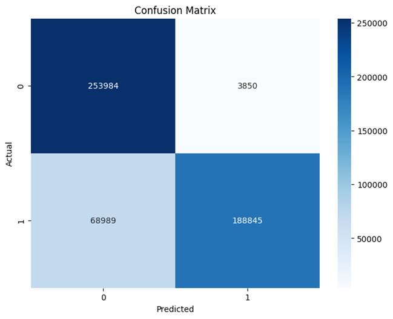
 
-	Модель правильно классифицировала 253 984 случаев как 0 и 188 845 случаев как 1.
-	Модель неправильно классифицировала 3 850 случаев как 0 и 68 989 случаев как 1.

> 3.	Модель KNN.

` Точность у модели получилось: 87.824% `
Посмотрим на ROC диаграмму:

 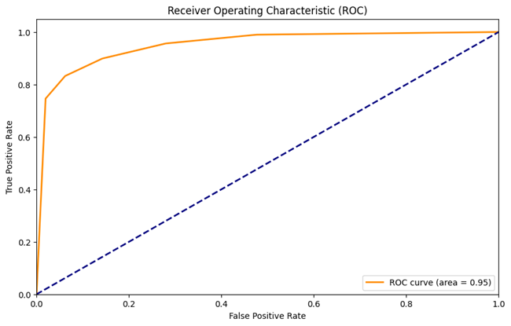
 
-	AUC-ROC составляет 0,95, что говорит о высокой прогностической способности модели.
-	Кривая ROC резко поднимается вверх от левого нижнего угла, что говорит о том, что модель хорошо различает положительные и отрицательные примеры.
-	Кривая ROC находится далеко от диагонали, что говорит о том, что модель значительно лучше, чем случайный классификатор.

Так же посмотрим на матрицу ошибок:

 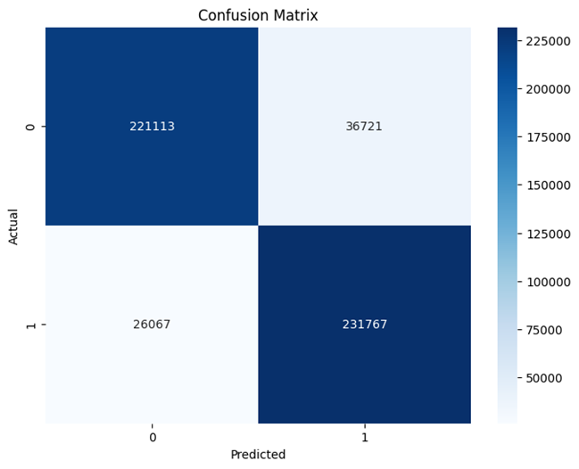
 
-	Модель правильно классифицировала 221 113 случаев как 0 и 231 767 случаев как 1.
-	Модель неправильно классифицировала 36 721 случаев как 0 и 26 067 случаев как 1.

> 4.	Модель RandomForest

` Точность у модели получилась: 97.496% `

Посмотрим на ROC диаграмму:

 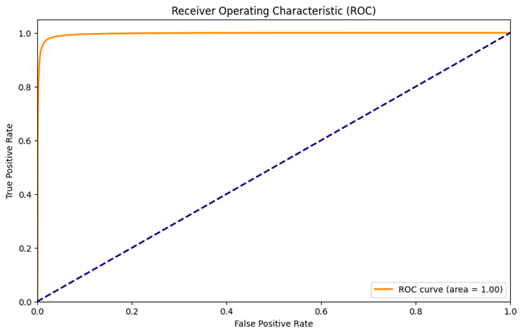
 
-	AUC-ROC составляет 1,00, что говорит о очень высокой прогностической способности модели.
-	Кривая ROC резко поднимается вверх от левого нижнего угла, что говорит о том, что модель отлично различает положительные и отрицательные примеры.
-	Кривая ROC находится далеко от диагонали, что говорит о том, что модель значительно лучше, чем случайный классификатор.

Так же посмотрим на матрицу ошибок:

 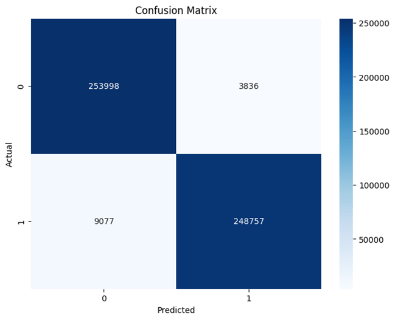
 
-	Модель правильно классифицировала 253 998 случаев как 0 и 248 757 случаев как 1.
-	Модель неправильно классифицировала 3 836 случаев как 0 и 9 077 случаев как 1.

` Вывод: Самый лучший результат показала модель RandomForest, с точностью 97.496%. `

  
## Оценка

Для оценки производительности модели использовались различные метрики, такие как Accuracy, ROC-AUC, F1-Score, Precision, и Recall
1.	Accuracy (Точность):
Эта метрика, используемая для оценки производительности классификационных моделей. Она показывает долю правильно предсказанных значений среди всех предсказаний модели 
2.	ROC-AUC Score:
Эта метрика используется для оценки качества модели при ранжировании, часто используется в задачах классификации. Она измеряет площадь под кривой ROC (Receiver Operating Characteristic).
3.	F1-Score:
Эта метрика является средним гармоническим между precision (точностью) и recall (полнотой). Высокое значение F1-score указывает на баланс между точностью и полнотой.
4.	Precision (Точность):
Точность показывает долю верных положительных результатов среди всех результатов, которые модель классифицировала как положительные.
5.	Recall (Полнота):
Полнота показывает долю верных положительных результатов среди всех истинно положительных примеров.

Результы метрик для всех моделей:

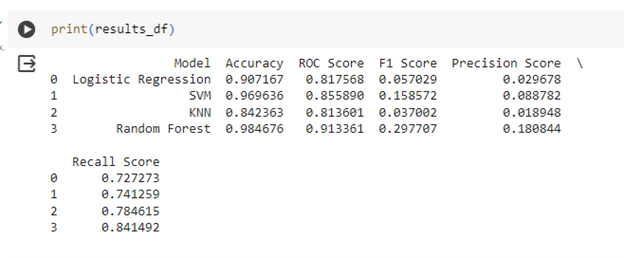
 
> Результаты для RandomForest:
```
Accuracy – 0, 984676

ROC-AUC Score – 0,913361

F1-Score – 0,297707

Precision – 0, 180844

Recall – 0,841492
```

`Так же использовались метрики для бизнес-целей:`

1.	Коэффициент обнаружения мошенничества

Эта метрика представляет собой процент мошеннических транзакций, которые модель правильно определила. В коде уже рассчитали показатель полноты (recall), который по сути является коэффициентом обнаружения мошенничества.

Получается, что модель правильно определила примерно `84,15%` мошеннических транзакций.

2.	Экономический эффект: общие финансовые потери, связанные с мошенничеством, после внедрения модели

Чтобы рассчитать экономический эффект нужно:

- Данные о суммах мошеннических транзакций.
- Ложноотрицательные результаты

Теперь нужно, умножить количество ложноотрицательных результатов на среднюю сумму мошеннической транзакции, чтобы оценить финансовые потери.

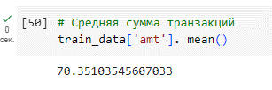
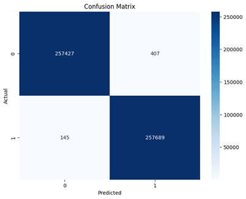
 
407 - Ложноотрицательных результатов

`70$ * 407 = 28490$ может потерять бизнес после внедрения модели.`


3.	Время обработки: время, необходимое для обработки транзакций и определения их как мошеннических или нормальных

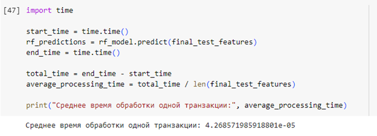
 
`Среднее время на обработку одной транзакции получилось 4,2 секунды.`


